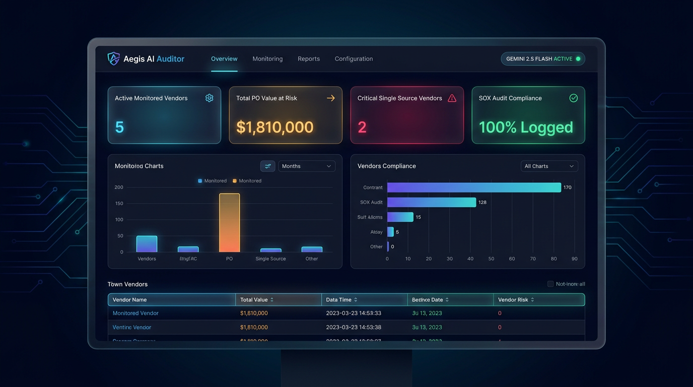
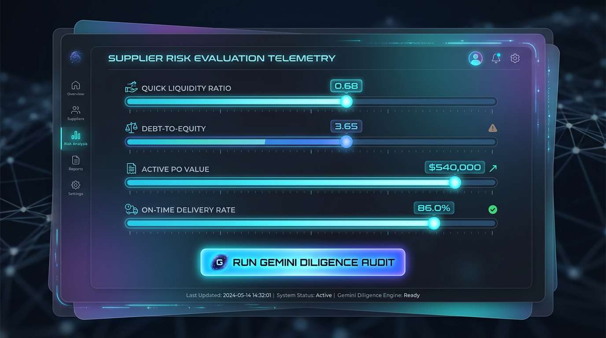
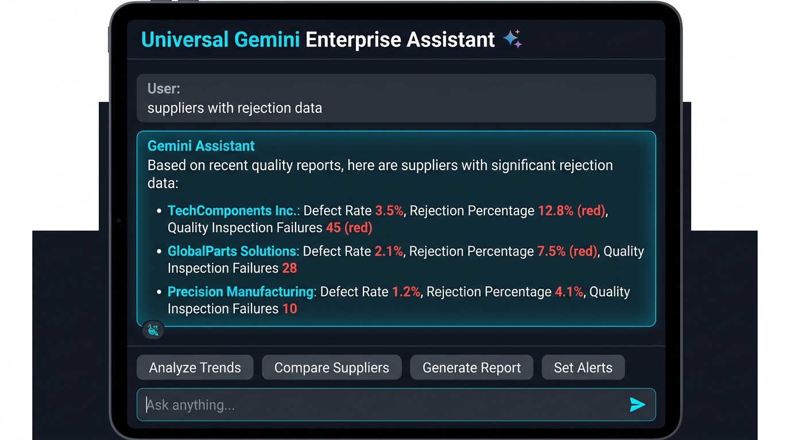

# 📘 Aegis AI Auditor: End-to-End Operational Manual & Step-by-Step Guide

### **Oracle Fusion Cloud ERP Autonomous Supplier Diligence System**

---

## 📸 System Screenshots & UI Visualizations

### 1. Enterprise Command Center Dashboard Overview
The Aegis Command Center provides real-time telemetry across rolling 180-day windows from Oracle Fusion ERP (`V_SUPPLIER_RISK_360`).



---

### 2. Interactive Supplier Risk Stress-Test Telemetry
Simulate financial shocks (liquidity dips, debt surges, delivery delays) live to test Gemini AI Auditor governance responses:



---

### 3. Universal Gemini Enterprise AI Assistant (RAG Chatbot)
Query real-time ERP data (rejection rates, open PO values, credit grades) or ask general knowledge questions:



---

## 🛠️ Step-by-Step Execution Guide

### Step 1: Execute Oracle Database View DDL (`v_supplier_risk_360.sql`)

Run this DDL script inside **Oracle SQL Developer**, **APEX SQL Commands**, or **OCI Autonomous Database SQL Console**:

```sql
CREATE OR REPLACE VIEW V_SUPPLIER_RISK_360 AS
WITH po_summary AS (
    SELECT vendor_id, COUNT(po_header_id) AS active_po_count, SUM(approved_amount) AS total_po_value
    FROM po_headers_all WHERE authorization_status = 'APPROVED' GROUP BY vendor_id
),
ap_summary AS (
    SELECT vendor_id, ROUND(AVG(NVL(payment_due_date, SYSDATE) - terms_date), 1) AS avg_payment_delay_days
    FROM ap_invoices_all WHERE creation_date >= SYSDATE - 180 GROUP BY vendor_id
),
pll_summary AS (
    SELECT ph.vendor_id,
        ROUND((COUNT(CASE WHEN pll.date_received <= pll.promised_date THEN 1 END) * 100.0) / NULLIF(COUNT(pll.line_location_id), 0), 2) AS on_time_delivery_rate
    FROM po_headers_all ph JOIN po_line_locations_all pll ON ph.po_header_id = pll.po_header_id GROUP BY ph.vendor_id
)
SELECT v.vendor_id, v.vendor_name, v.attribute1 AS credit_rating,
       TO_NUMBER(v.attribute2) AS quick_ratio, TO_NUMBER(v.attribute3) AS debt_to_equity,
       NVL(ps.total_po_value, 0) AS total_po_value, NVL(aps.avg_payment_delay_days, 0) AS avg_payment_delay_days,
       NVL(pll.on_time_delivery_rate, 100) AS on_time_delivery_rate,
       MAX(CASE WHEN v.vendor_type_lookup_code = 'CRITICAL_SINGLE_SOURCE' THEN 1 ELSE 0 END) AS single_source_flag
FROM po_vendors v
LEFT JOIN po_summary ps ON v.vendor_id = ps.vendor_id
LEFT JOIN ap_summary aps ON v.vendor_id = aps.vendor_id
LEFT JOIN pll_summary pll ON v.vendor_id = pll.vendor_id
GROUP BY v.vendor_id, v.vendor_name, v.attribute1, v.attribute2, v.attribute3, ps.total_po_value, aps.avg_payment_delay_days, pll.on_time_delivery_rate;
```

---

### Step 2: Configure Gemini Core Agent (`system_instruction.txt`)

Load the system instructions into your Python GenAI wrapper or OCI Generative AI Agent service.

```python
from google import genai
from google.genai import types

client = genai.Client()
response = client.models.generate_content(
    model="gemini-2.5-flash",
    contents=payload_json,
    config=types.GenerateContentConfig(
        system_instruction=system_instruction_text,
        response_mime_type="application/json"
    )
)
```

---

### Step 3: Deploy OCI Function Serverless Engine (`handler.py`)

Deploy `handler.py` to Oracle Cloud Infrastructure (OCI Functions) using `fn deploy --app aegis-app`:

```yaml
# func.yaml
schema_version: 20180708
name: parse-supplier-risk
version: 0.0.1
runtime: python
entrypoint: /python/bin/fdk /function/handler.py handler
```

---

### Step 4: Install Oracle PL/SQL Governance Package (`supplier_risk_governance_pkg.sql`)

Execute the PL/SQL script in your Oracle Fusion ERP schema to create the audit log table and package:

```sql
-- Create SOX Audit Log Table
CREATE TABLE AI_FINANCIAL_AUDIT_LOG (
    log_id                 NUMBER PRIMARY KEY,
    vendor_id              NUMBER NOT NULL,
    vendor_name            VARCHAR2(240),
    overall_risk_rating    VARCHAR2(50),
    recommended_action     VARCHAR2(100),
    financial_risk_score   NUMBER,
    scm_resilience_score   NUMBER,
    sox_compliance_flag    VARCHAR2(5) DEFAULT 'TRUE',
    justification          CLOB,
    created_by             VARCHAR2(100) DEFAULT USER,
    creation_date          DATE DEFAULT SYSDATE
);

-- Execute Automated Audit & Apply Holds
EXEC PKG_SUPPLIER_RISK_GOVERNANCE.PROCESS_GEMINI_AUDIT_RESPONSE(p_vendor_id => 100102, p_gemini_json => '...');
```

---

### Step 5: Run Verification Matrix & Local Command Center (`server.py`)

Launch the local test server and interactive web app:

```bash
cd oracle-fusion-supplier-risk-gemini-auditor
python3 server.py
```

Then open **[http://localhost:8080](http://localhost:8080)** to access the dashboard!

---

## 🧪 Verification Matrix Results

| Test Case | Scenario Description | Quick Ratio | Debt/Equity | Delivery Rate | Gemini Risk Rating | Executed Action |
| :---: | :--- | :---: | :---: | :---: | :---: | :--- |
| **TC1** | Healthy Vendor | 1.85 | 1.10 | 96.5% | `LOW` | `APPROVE` |
| **TC2** | Liquidity Crisis | 0.68 | 3.65 | 86.0% | `HIGH` | `HOLD_PO_PAYOUTS` |
| **TC3** | Supply Bottleneck | 0.92 | 2.25 | 64.5% | `CRITICAL` | `REROUTE_SUPPLIER_ALLOCATION` |

---

<div align="center">
  <b>Aegis AI Auditor &bull; Oracle Fusion Cloud ERP & Google Gemini 2.5</b>
</div>
